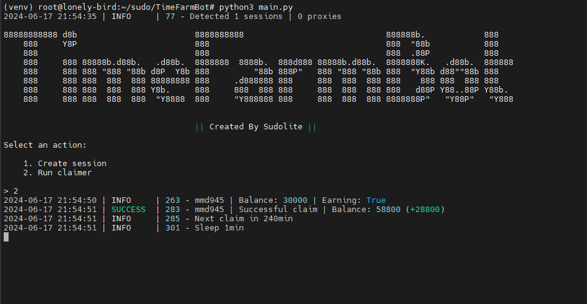

[](https://t.me/SudoLite)



> 🇮🇷 README available in Persian [here](README-FA.md)

> Special Thanks [shamhi](https://github.com/shamhi)

## Functionality
| Functional                                                     | Supported |
|----------------------------------------------------------------|:---------:|
| Multithreading                                                 |     ✅     |
| Binding a proxy to a session                                   |     ✅     |
| Auto get all tasks except telegram tasks                       |     ✅     |
| Auto upgrade level for boost farming                           |     ✅     |
| Retry request per claim                                        |     ✅     |
| Support tdata / pyrogram .session / telethon .session          |     ✅     |

## [Settings](https://github.com/SudoLite/TimeFarmBot/blob/main/.env-example)
| Setting                   | Description                                                                   |
|---------------------------|-------------------------------------------------------------------------------|
| **API_ID / API_HASH**     | Platform data from which to launch a Telegram session (stock - Android)       |
| **CLAIM_RETRY**           | Number of tries if **Claim** is unsuccessful _(e.g., 3)_                      |
| **SLEEP_BETWEEN_CLAIM**   | Delay between **Claim** in minutes _(e.g., 180)_                              |
| **AUTO_UPGRADE_FARM**     | Should I improve farmer level _(True / False)_                                |
| **MAX_UPGRADE_LEVEL**     | Maximum level of farmer _(up to 4)_                                          |
| **USE_PROXY_FROM_FILE**   | Whether to use proxy from the `bot/config/proxies.txt` file (True / False)    |

## Installation
You can download the [**Repository**](https://github.com/SudoLite/TimeFarmBot) by cloning it to your system and installing the necessary dependencies:
```shell
~ >>> git clone https://github.com/SudoLite/TimeFarmBot.git
~ >>> cd TimeFarmBot

# If you are using Telethon sessions, then clone the "converter" branch
~ >>> git clone https://github.com/SudoLite/TimeFarmBot.git -b converter
~ >>> cd TimeFarmBot

#Linux
~/TimeFarmBot >>> python3 -m venv venv
~/TimeFarmBot >>> source venv/bin/activate
~/TimeFarmBot >>> pip3 install -r requirements.txt
~/TimeFarmBot >>> cp .env-example .env
~/TimeFarmBot >>> nano .env # Here you must specify your API_ID and API_HASH, the rest is taken by default
~/TimeFarmBot >>> python3 main.py

#Windows
~/TimeFarmBot >>> python -m venv venv
~/TimeFarmBot >>> venv\Scripts\activate
~/TimeFarmBot >>> pip install -r requirements.txt
~/TimeFarmBot >>> copy .env-example .env
~/TimeFarmBot >>> # Specify your API_ID and API_HASH, the rest is taken by default
~/TimeFarmBot >>> python main.py
```

Also, for a quick launch, you can use arguments, for example:
```shell
~/TimeFarmBot >>> python3 main.py --action (1/2)
# Or
~/TimeFarmBot >>> python3 main.py -a (1/2)

#1 - Create session
#2 - Run clicker
```